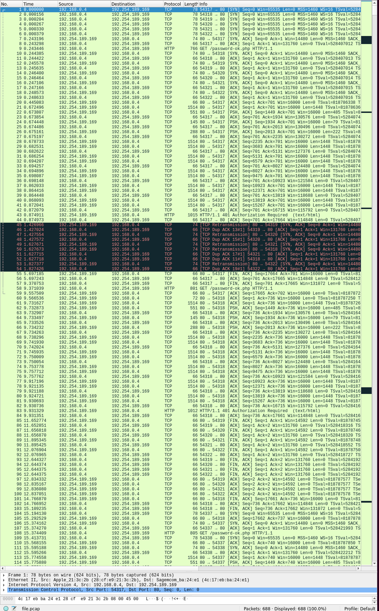
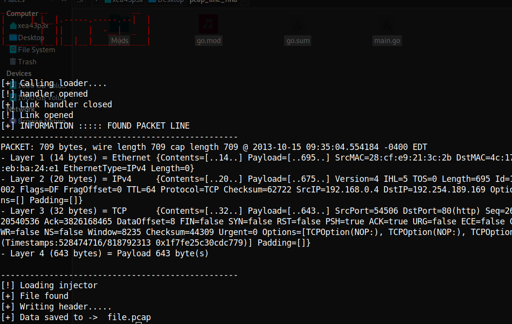
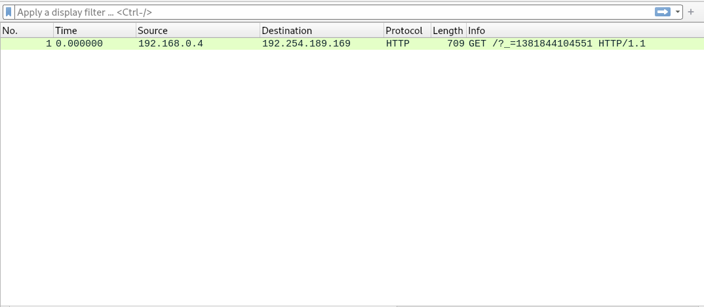

```
_____   __                 __ 
|     |_|__|.-----.-----.--|  |
|       |  ||     |  -__|  _  |
|_______|__||__|__|_____|_____|
```

# What was this made for 

As some of you know i have been researching a C++ vulnerability within a code library as an example for advanced and unsecure C++ programs. If you dont please read my article on it seen here 

https://medium.com/the-hacker-outpost/coming-across-c-bof-buffer-overflow-vulnerabilities-within-libraries-bc8318bb17da

As of this tools release i am currently researching a part of the buffer overflow to see if it was due to a value being returned empty or if the 
developers actually did alot more damage than that, well this tool i developed to test this theory. Basically i have two seperate network captures 
all of them have more than 9,000 packets each and i need to extract one with a HTTP cookie and the other one that captured a GET request WITHOUT 
a HTTP cookie. So this tool will take the following arguments 

a input file such as example.pcap, a output file such as output.pcap, a line number to search on such as  511, and a snaplength which is in our case 1024.

# Examples 

**INPUT FILE**

<p align="center">
  
</p>


**OUTPUT FROM TOOL**

<p align="center">
  
</p>


** OUTPUT PCAP FILE **

<p align="center">
  
</p>

